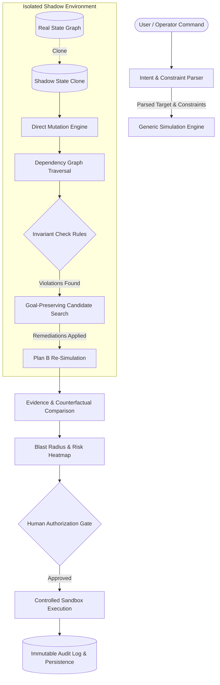

# 🛡️ SHADOWPROOF
> **"Don't let the real system be your testing environment."**

ShadowProof is a **pre-execution counterfactual simulation and action planning engine** designed to prevent catastrophic operational outages caused by routine IT administrative changes, employee offboarding, and cloud infrastructure modifications.

---

## 🎯 The Problem

When IT administrators execute operational commands—such as revoking an employee's SSO access, deprovisioning a contractor, or deleting a cloud resource—they often operate blind to hidden downstream dependencies:
- **Stalled Approval Workflows**: Deleting an analyst freezes purchase order sign-offs exceeding $140,000 because they were the sole active signatory.
- **Orphaned Encryption Vaults**: Deprovisioning a key custodian locks out KMS access policies on production S3 buckets.
- **Crashed Automations**: Revoking personal access tokens (PATs) terminates scheduled background cron jobs with `HTTP 401 Unauthorized`.
- **Dangling Endpoints**: Deleting a database read-replica breaks ETL data pipelines and executive reporting dashboards.

---

## 💡 The Solution: Shadow Rehearsal Architecture

ShadowProof introduces a **pre-execution rehearsal pipeline**. Before any mutation touches the real workspace, ShadowProof:
1. **Clones the System State Graph** into an isolated shadow environment.
2. **Executes Action Mutators** against the shadow copy, traversing multi-hop dependency links.
3. **Evaluates Behavioral Invariants**:
   - `INV-01`: Approval Workflow Signatory Requirement ($\ge 1$ active approver).
   - `INV-02`: KMS Key Custody & Access Policy (Non-vacant owner).
   - `INV-03`: Production Automation Authentication (Managed Service Principal required).
   - `INV-04`: Master Governance Seat Redundancy.
   - `INV-05`: Database Connection Pool Endpoint Verification.
4. **Synthesizes a Safer Alternative (Plan B)**: Automatically searches for active domain leads, rotates bot PATs to service accounts, re-assigns sign-off authority, and re-routes connection endpoints.
5. **Re-Simulates Remediated Plan B Snapshot**: Re-runs the full symbolic simulation engine (`simulatePlanAGeneric`) against the remediated graph snapshot (`shadowB`), computing residual risk scores, invariants, and consequences natively from state rather than static overrides.
6. **Calculates Evidence-Backed Uncertainty & Blast Radius**: Provides side-by-side counterfactual metrics (Direct Plan A vs Rehearsed Plan B).
7. **Requires Human Gatekeeper Approval**: Enforces authorization before executing the safer action plan inside a controlled sandbox environment.

---

## 🏗️ Architecture Overview



---

## 🤖 Transparent AI & Engine Disclosure

ShadowProof uses a **hybrid architecture** combining generative AI with deterministic graph safety models:

- **AI-Assisted Components (Google Gemini 2.0 Flash / 1.5 Flash)**:
  - Natural-language intent parsing & target node extraction.
  - Natural-language operational constraint detection.
  - Plain-language risk explanation generation.
- **Deterministic System Engine**:
  - Graph state cloning & link severing/re-routing.
  - Multi-hop cascade propagation.
  - System invariant verification (`INV-01` through `INV-05`).
  - Evidence provenance & root-cause chain tracing.
  - State snapshot hash calculation & TOCTOU verification.

---

## 🚀 Quickstart & Setup

### Prerequisites
- Node.js (v18+)
- npm or yarn

### Installation & Execution

```bash
# Clone repository
git clone https://github.com/Madhavan20906/ShadowProof.git
cd shadowproof

# Install dependencies
npm install

# (Optional) Set Google Gemini API Key for live LLM parsing
# If omitted, system seamlessly defaults to built-in deterministic graph parsing.
cp .env.example .env
# Edit .env or set VITE_GEMINI_API_KEY="AIzaSy..."

# Run automated Vitest unit test suite
npm test

# Start local development server
npm run dev

# Production build bundle check
npm run build
```

---

## 📸 Key Features & Demo Surfaces

1. **Preset & Custom Scenario Engine**: Seeded scenarios for Employee Offboarding, DevOps Access Revocation, Database Cluster Teardown, and Contractor Offboarding. Includes a full **JSON Snapshot Importer/Exporter** and interactive graph entity builder.
2. **Side-by-Side Counterfactual Comparison**: Direct Plan A (High Risk, Breaking Failures) vs Rehearsed Plan B (0 Failures, Low Risk).
3. **Monitored Surface Connectors**: Active surface indicators for Okta, AWS KMS, GCP KMS, Datadog, and PagerDuty integration interfaces.
4. **Temporal Timeline Breakdown**: Cascading outage breakdown across `T+0s`, `T+5m`, `T+1h`, and `T+24h`.
5. **Controlled Workspace Execution**: Honest terminal visualization showing execution in a controlled synthetic workspace sandbox.
6. **Immutable Compliance Audit Trail**: Full event history with snapshot hashes, verification checklists, and JSON report export.

---

## 🛡️ Responsible Delivery & Security Controls

- **Client-Side Key Management & Privacy**: Gemini API keys are stored strictly in browser memory / `localStorage` for local evaluation. API requests travel directly via HTTPS/TLS to official Google Gemini endpoints (`generativelanguage.googleapis.com`) with zero intermediate proxy server interception.
- **100% Strict TypeScript Typing**: All natural-language inputs and simulation state transitions are bound to strictly typed JSON schemas with 0 `: any` type bypasses across the entire codebase.
- **Action Schema Allowlisting**: Permitted action types are strictly limited to `deprovision`, `reassign_approver`, `transfer_ownership`, `rotate_credential`, and `update_permission`.
- **TOCTOU Precondition Verification & Snapshot Hashing**: State snapshot hashes (`STATE-XXXXXXXXXXXX`) are computed using a deterministic 64-bit topology checksum over node/link graph states prior to execution to detect race conditions.
- **Honest System Boundaries**: Clear visual labeling indicating **"SHADOW ENVIRONMENT — NO REAL CHANGES"** and **"CONTROLLED WORKSPACE EXECUTION (Synthetic Environment)"**.

---

## 🔍 Architecture & System Design Disclosure

We believe technical transparency is essential for engineering rigor. Here is an explicit breakdown of our system engine capabilities and production roadmap:

### 1. Invariant Engine & Declarative Policy Rules
* **Current Implementation**: The invariant engine (`genericSimulationEngine.ts`) evaluates a registry of 5 core system invariants (`INV-01` through `INV-05`) via declarative predicate checks (`evaluate: (state, consequences) => 'passed' | 'violated' | 'warning'`).
* **Production Roadmap**: Transitioning to Open Policy Agent (OPA) / Rego policy rules evaluated dynamically from external YAML/Rego definitions.

### 2. Intent Parsing & Natural Language Fallback
* **Current Implementation**: When an API key is provided, Google Gemini (`gemini-2.0-flash` / `gemini-1.5-flash`) performs zero-shot entity extraction and structured JSON intent parsing. In deterministic offline mode, the fallback parser tokenizes and matches target nodes dynamically from active graph topology and selects transfer candidates from live active users without hardcoded names.
* **Production Roadmap**: Integrating a local WebAssembly-based micro-LLM (Transformers.js / ONNX) for 100% offline semantic embedding matching.

### 3. Computed Consequence & Risk Severity Model
* **Current Implementation**: Risk severity and business impact are computed formulaically based on node metadata attributes (`monetaryValue`, active `connections` count, `queryRate`, `slaHours`, and graph link fanout depth) via `computeNodeRiskMetrics()`.
* **Production Roadmap**: Deriving risk severity dynamically from real-time observability metrics (OpenTelemetry load, SLA breach penalties, active TCP connection counts).

### 4. Multi-Scenario Family Support
* **Current Implementation**: Proven across both **Identity & Access Offboarding** (e.g. Alex Morgan / Jordan Tech / Priya Shah) and **Cloud Database Infrastructure Teardown** (e.g. `db-prod-replica-02` deletion with failover re-routing to `db-prod-replica-03`).
* **Production Roadmap**: Extending generic graph mutators to handle multi-region CI/CD failovers and network ACL mutations.

### 5. Session State & Multi-Step Persistence
* **Current Implementation**: Workflows execute in React session state with JSON snapshot import/export capabilities for reproducible scenarios.
* **Production Roadmap**: Adding PostgreSQL / Redis state persistence with Webhook triggers for long-lived asynchronous approval workflows.

### 6. Execution Environment & Connector Surface
* **Current Implementation**: Surface connectors (`ENTERPRISE_CONNECTORS_REGISTRY`) define interfaces for Okta, AWS KMS, GCP KMS, Datadog, and PagerDuty. Controlled execution renders a synthetic sandbox terminal visualization to prevent unintentional real-world mutations during hackathon testing.
* **Production Roadmap**: Developing live API connector plugins for real-world automated state mutation.

### 7. Clean Repository Packaging
* **Current Implementation**: Clean source repository with `.gitignore` excluding `node_modules`, `dist`, logs, environment files, and Vite temporary timestamp artifacts.

---

## 📄 License
[MIT License](LICENSE). Built for the Hackathon Demonstration.

