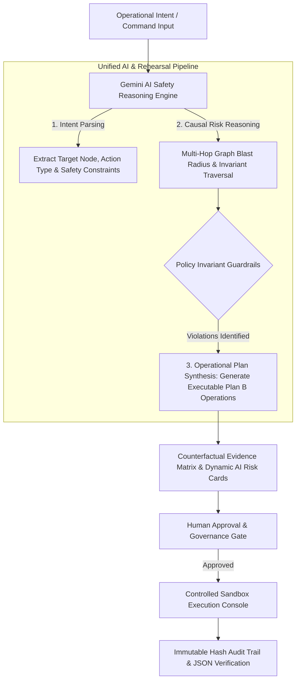

# 🛡️ ShadowProof — Pre-Execution Safety Rehearsal Engine

[](https://github.com/Madhavan20906/ShadowProof)
[](https://react.dev/)
[](https://www.typescriptlang.org/)
[](https://tailwindcss.com/)
[](https://ai.google.dev/)
[](LICENSE)

> **"Don't let your production environment be your testing ground."**

**ShadowProof** is an enterprise-grade **pre-execution counterfactual rehearsal engine**. Powered by Google Gemini, ShadowProof intercepts destructive operational intents (SSO offboarding, cloud resource deletion, database teardown, or API token revocation), clones the topology graph, simulates multi-hop failure cascades, evaluates compliance invariants, and synthesizes non-destructive **Plan B (Rehearsed Execution)** graph operations in real-time.

---

## 💥 The Core Problem: Invisible Downstream Cascades

When SREs, IT Administrators, or Security Operations execute routine operational changes:
- ❌ **Frozen Approval Chains**: Deprovisioning a finance analyst halts $140K+ purchase order approvals because they were the sole active signatory.
- ❌ **Orphaned KMS Vaults**: Deleting a key custodian revokes access policies to production S3 KMS encryption keys.
- ❌ **Crashed Data Automations**: Revoking personal access tokens (PATs) causes daily payroll sync bots to crash with `HTTP 401 Unauthorized`.
- ❌ **Dangling Database Replicas**: Dropping a database replica breaks BI dashboards and downstream ETL pipelines.

---

## ⚡ The Solution: Gemini AI Safety Rehearsal Architecture

ShadowProof intercepts operational intents and runs a **unified Gemini AI Safety Reasoning Pipeline**:



---

## ✨ Key Features & Capabilities

| Feature | Description |
| :--- | :--- |
| **Gemini AI Safety Reasoning Engine** | Core AI engine leveraging Google Gemini (`gemini-3.6-flash` / `gemini-2.5-flash`) to parse intents, extract implicit safety constraints, evaluate causal risk, and synthesize ordered Plan B graph operations. |
| **Plan B Remediation Synthesis** | Generates concrete, executable graph operations (`planB_steps`: key custody transfers, dependency re-routing, fallback delegation) that resolve invariant breaches without human guesswork. |
| **Comparative Blast Radius Engine** | Dynamic computation of Risk Scores (0-100), blast radius depth, and breaking failure consequences for both **Plan A (Direct)** and **Plan B (Rehearsed)**. |
| **Policy Invariant Guardrails** | Enforces 5 strict system invariants (`INV-01` through `INV-05`) verifying approval signatories, KMS key custody, automation principal auth, master governance seats, and database connection pools. |
| **Interactive Topology Visualizer** | Full SVG dependency graph visualization with node drag-and-drop, topological auto-layout, search/filtering, and interactive blast radius heatmaps. |
| **Temporal Consequence Breakdown** | Detailed impact timeline forecasting downstream failures at `T+0s`, `T+5m`, `T+1h`, and `T+24h`. |
| **Controlled Sandbox Console** | Real-time synthetic terminal emulator demonstrating zero-outage execution with live log streaming. |
| **Immutable Compliance Audit Trail** | SHA-256 snapshot hashing, digital approval signatures, verification checklists, and downloadable compliance audit logs. |

---

## 🛠️ Tech Stack & Architecture

- **Frontend & UI**: React 18, TypeScript, TailwindCSS, Lucide Icons, Vite
- **AI Safety Engine**: Google Gemini REST API (`aiReasoningEngine.ts`) with prompt-driven intent parsing, constraint extraction, causal risk analysis, and plan synthesis
- **Graph & Topology Engine**: Custom graph traversal algorithms (`genericPlanner.ts`, `genericSimulationEngine.ts`)
- **Resilience & Fallback**: Zero-downtime offline deterministic fallback engine and cached model resolution with 429 rate-limit protection
- **Testing & Tooling**: Vitest, PostCSS, ESLint

---

## 🚀 Quickstart & Local Setup

### Prerequisites
- **Node.js**: v18.0.0 or higher
- **npm** or **yarn**

### Installation

```bash
# 1. Clone repository
git clone https://github.com/Madhavan20906/ShadowProof.git
cd ShadowProof

# 2. Install dependencies
npm install

# 3. (Optional) Configure Gemini API Key
# If omitted, the engine automatically runs in deterministic offline mode!
cp .env.example .env
# Set VITE_GEMINI_API_KEY="your-google-gemini-api-key"

# 4. Launch local development server
npm run dev
```

Open your browser at `http://localhost:5173`.

### Running Tests & Production Build

```bash
# Run unit tests
npm test

# Build production bundle
npm run build
```

---

## 📁 Repository Structure

```
shadowproof/
├── src/
│   ├── components/            # React UI Components
│   │   ├── AIRiskCard.tsx       # AI Risk & Safety Reasoning Card
│   │   ├── DependencyGraph.tsx  # Interactive SVG Graph Visualizer
│   │   ├── EvidenceMatrix.tsx   # Side-by-side Plan A vs Plan B Evidence Matrix
│   │   ├── Header.tsx           # Global Header & Engine Status
│   │   ├── IntentInput.tsx      # Natural Language Command Input
│   │   ├── PolicyCheckPanel.tsx # Invariant Check Verification Panel
│   │   └── ...
│   ├── engine/                # Core Simulation & AI Engines
│   │   ├── aiReasoningEngine.ts # Gemini AI Safety Reasoning Engine (Intent, Constraints, & Plan B synthesis)
│   │   ├── intentParser.ts      # Legacy Intent Parser Wrapper
│   │   ├── genericPlanner.ts    # Comparative Plan Generator & State Search
│   │   ├── genericSimulationEngine.ts # Multi-hop Graph Traversal & Invariants
│   │   └── shadowEngine.ts      # Legacy Scenario Engine Wrappers
│   ├── mock/                  # Preset Scenarios & Initial State Topology
│   └── types/                 # TypeScript Interfaces & Systems Models
├── dist/                      # Production Build Distribution
├── vercel.json                # Vercel Deployment Configuration
├── netlify.toml               # Netlify Deployment Configuration
└── README.md                  # System Documentation
```

---

## 🔒 Security & Privacy Controls

- **Zero Middleware Key Storage**: Your Google Gemini API key is kept locally in browser `localStorage` / environment variables. It travels directly via HTTPS to Google's official endpoints (`generativelanguage.googleapis.com`).
- **100% Type-Safe Contracts**: All graph state mutations, action plans, and LLM payloads are strictly bound to TypeScript types with zero `: any` type bypasses.
- **TOCTOU Snapshot Hashing**: State snapshot topology hashes (`STATE-XXXXXXXX`) detect race conditions before controlled execution.

---

## 📄 License

This project is licensed under the **MIT License** — see the [LICENSE](LICENSE) file for details.
